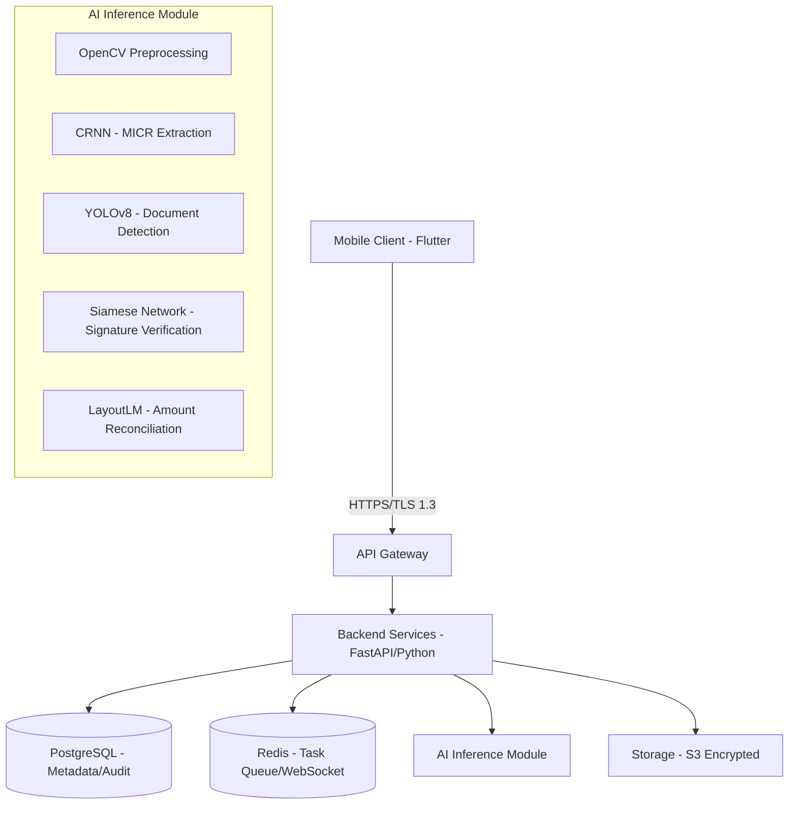

# CheckStudio: Technical Blueprint

## 1. System Architecture Overview

CheckStudio is designed as a mission-critical financial application. The architecture separates heavy AI inference from low-latency client interactions.

### High-Level Diagram



---

## 2. Image Preprocessing & Capture

### Real-time Mobile Guidance
The Flutter client uses a custom camera controller with the following features:
- **Hough Transform**: To detect check edges in real-time.
- **Blur Detection**: Using Laplacian variance to ensure images are sharp enough for OCR.
- **Glare Detection**: Luminance analysis to prevent reflective spots over MICR or Signature.

### OpenCV Deskew & Enhancement
On the backend, incoming images undergo:
1. **Grayscale conversion** & **Adaptive Thresholding**.
2. **Perspective Correction**: Using four-point transform based on detected corners.
3. **Deskewing**: Rotating the image to align text horizontally.

---

## 3. OCR & MICR Extraction

### MICR E13B Parsing
We use a specialized Convolutional Recurrent Neural Network (CRNN) trained on the E13B font character set.
- **Routing Number**: 9 digits, validated via checksum.
- **Account Number**: Variable length.
- **Check Number**: Matching against the top-right printed number.

```python
# Sample MICR Algorithm
def validate_routing(routing):
    # 3(d1+d4+d7) + 7(d2+d5+d8) + (d3+d6+d9) mod 10 == 0
    weights = [3, 7, 1] * 3
    total = sum(int(d) * w for d, w in zip(routing, weights))
    return total % 10 == 0
```

---

## 4. Signature Verification (Forgery Detection)

### Siamese Dual-Stage Approach
1. **Presence Check**: Bounding box detection on the "Authorized Signature" line.
2. **Siamese Network**: A CNN (like VGG16 or ResNet) extracts feature embeddings from both the *captured* signature and the *reference* signature on file. 
3. **Euclidean Distance**: If the distance between embeddings is below a threshold, the signature is deemed authentic.

---

## 5. Check Integrity & Endorsement

### Hashing & Duplicates
We use **pHash (Perceptual Hashing)** to generate a unique fingerprint of the check image. This is more robust than MD5 as it persists through minor compression or lighting changes.

### Endorsement OCR
Forced check for the string "For Mobile Deposit Only" on the back.
- **Location**: Top 2 inches of the check back.
- **Logic**: If the specific string isn't detected with >85% confidence, the deposit is rejected.

---

## 6. Amount Extraction & Resolution

### Dual-Check System
- **CAR (Courtesy Amount Recognition)**: Extracts numerical digits (e.g., "$100.00").
- **LAR (Legal Amount Recognition)**: Extracts handwritten words (e.g., "One Hundred Dollars").
- **Reconciliation**: NLP logic matches "One Hundred" == 100. If they mismatch, the check is flagged for manual review.

---

## 7. Security & Compliance

### PCI & GLBA Enforcement
- **Encryption**: AES-256 at rest, TLS 1.3 in transit.
- **PII Masking**: In logs, account numbers are masked (e.g., `XXXX-1234`).
- **Audit Logging**: Every action (capture, failure, approve) is logged with a source IP and device ID.
- **NACHA Rules**: Compliance with Reg CC (Availability of Funds) by checking check age and source.

---

## 8. Deployment Plan

### AWS / GCP Strategy
- **Containerization**: Docker images for FastAPI and AI models.
- **Orchestration**: Kubernetes (EKS/GKE) for scaling.
- **Storage**: AWS S3 with Object Lock (prevent tampering).
- **GPU Inference**: AWS Inf1 instances for high-speed model execution.

---

## 9. Mobile Frontend UX

### Wireframe Description
1. **Launch Screen**: Biometric login.
2. **Deposit Workflow**:
   - `Step 1`: Capture Front (Overlay helps alignment).
   - `Step 2`: Capture Back (Instruction: Endorse check).
   - `Step 3`: Confirm Amount (AI pre-fills, user reviews).
3. **Success Screen**: Shows estimated availability date.
